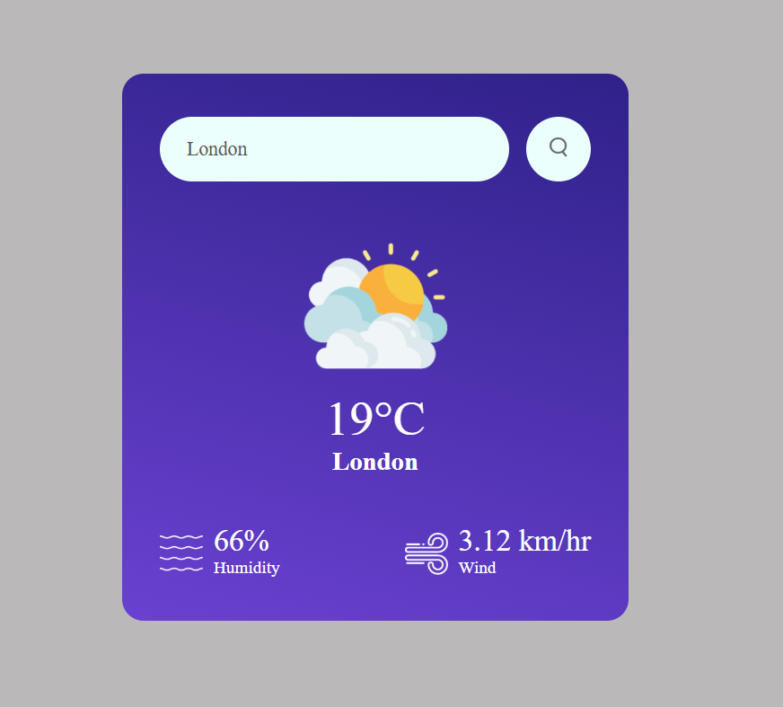
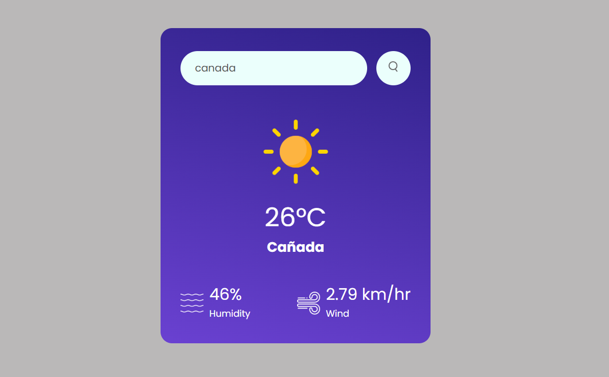

# Weather-app
A simple and clean weather app made with HTML, CSS, and JavaScript. Just type a city name to see the current temperature, humidity, wind speed, and a weather icon that matches the condition. It’s fast, responsive, and easy to use for anyone!

## 🔍 Features

- 🌐 Search weather by city name
- 🌡️ Displays current temperature (°C)
- 💧 Shows humidity percentage
- 🌬️ Displays wind speed (km/hr)
- 🌤️ Dynamic weather icons (sun, clouds, rain, snow, etc.)
- ⚠️ Handles errors for invalid or empty inputs
- 🎯 Fully responsive and mobile-friendly UI

## 🖼️ Screenshots

| London | Canada |
|--------|--------|
|  |  |
